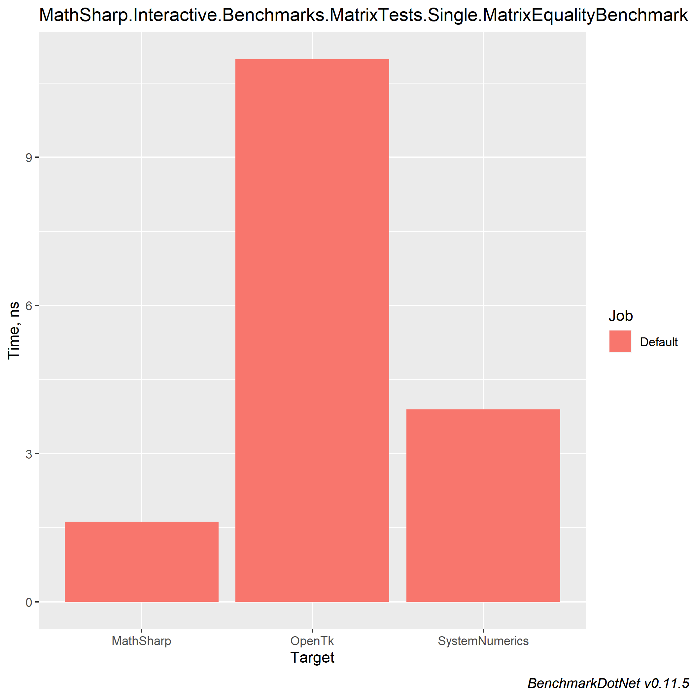
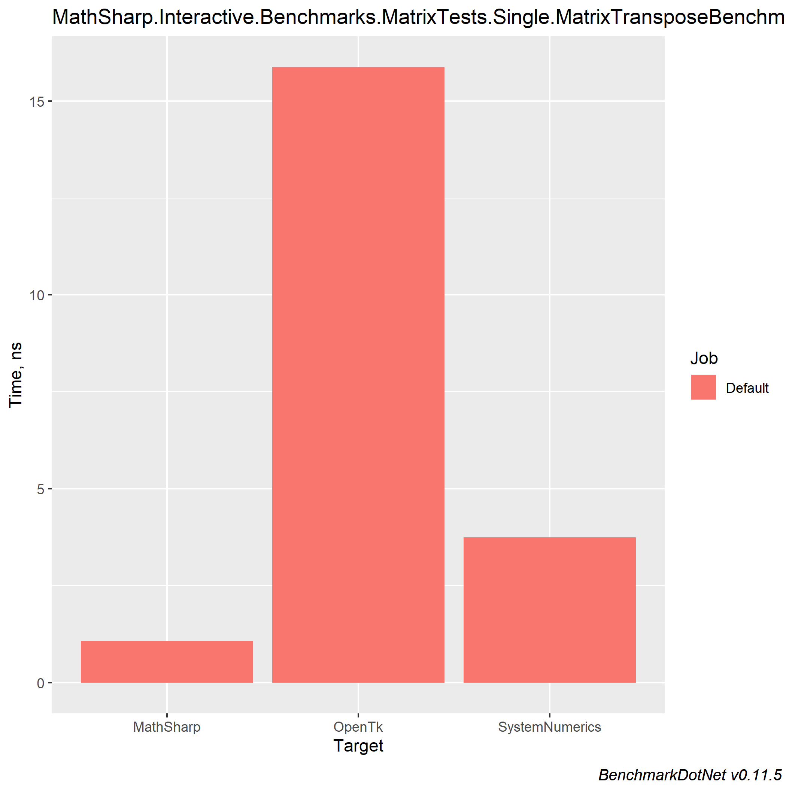
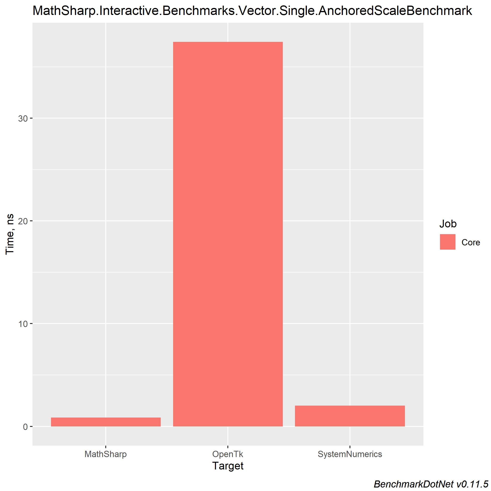
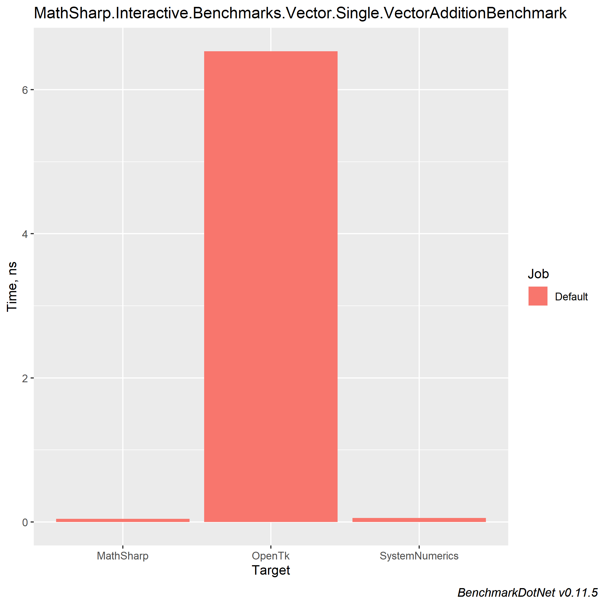

# MathSharp

|Configuration|Windows x86|Windows x64|Ubuntu 1604 x64|Mac OS x64|
|:--:|:--:|:--:|:--:|:--:|
|**Debug**|[](https://johnkellyoxford.visualstudio.com/MathSharp/_build/latest?definitionId=3&branchName=master)|[](https://johnkellyoxford.visualstudio.com/MathSharp/_build/latest?definitionId=3&branchName=master)|[](https://johnkellyoxford.visualstudio.com/MathSharp/_build/latest?definitionId=3&branchName=master)|[](https://johnkellyoxford.visualstudio.com/MathSharp/_build/latest?definitionId=3&branchName=master)|
|**Release**|[](https://johnkellyoxford.visualstudio.com/MathSharp/_build/latest?definitionId=3&branchName=master)|[](https://johnkellyoxford.visualstudio.com/MathSharp/_build/latest?definitionId=3&branchName=master)|[](https://johnkellyoxford.visualstudio.com/MathSharp/_build/latest?definitionId=3&branchName=master)|[](https://johnkellyoxford.visualstudio.com/MathSharp/_build/latest?definitionId=3&branchName=master)|


MathSharp is a vector and matrix library written in C# using hardware intrinsics. Thanks to hardware acceleration, MathSharp is significantly faster than most mathematics libraries out there, but only supports .NET Core 3.0 and up.

MathSharp beats out all alternative for speed. Comparing it to the `System.Numerics` types and the `OpenTk.Math` types shows just how fast it is:

[All benchmarks were taken using BenchmarkDotNet on an i3-8350k at stock speeds with minimal background activity, with .NET Core 3.0.100]

## Matrix Equality

### Operation

```cs
Matrix4x4 == Matrix4x4
```

### Results

<!-- -->



|         Method |      Mean |     Error |    StdDev |
|--------------- |----------:|----------:|----------:|
|         OpenTk | 10.984 ns | 0.1087 ns | 0.1017 ns |
| SystemNumerics |  3.895 ns | 0.0185 ns | 0.0164 ns |
|      MathSharp |  1.622 ns | 0.0109 ns | 0.0102 ns |

## Matrix Transposition

### Operation

```cs
Transpose(Matrix4x4)
```

### Results

<!---->


|         Method |      Mean |     Error |    StdDev |
|--------------- |----------:|----------:|----------:|
|         OpenTk | 10.984 ns | 0.1087 ns | 0.1017 ns |
| SystemNumerics |  3.895 ns | 0.0185 ns | 0.0164 ns |
|      MathSharp |  1.622 ns | 0.0109 ns | 0.0102 ns |

## Sine Wave Generation

### Operation

```cs
const int SampleRate = 44100;
const float Tau = MathF.PI * 2;
const float Frequency = 440;

for (var i = 0; i < waveInputs.Length; i++)
{
    waveInputs[i] = Sin(Tau * Frequency * ((float)i / SampleRate));
}
```

### Results

<!---->


|      Method |      Mean |     Error |    StdDev |
|------------ |----------:|----------:|----------:|
| SystemMathF | 412.30 us | 1.6319 us | 1.5265 us |
|   MathSharp |  80.37 us | 0.6465 us | 0.6048 us |

## Anchored Scale Operation

### Operation

```cs
const Vector2 Translation = new Vector2(1.7f, 2.3f);
const Vector2 Anchor = new Vector2(1.0f, 0.0f);
const Vector2 Scale = new Vector2(7.0f, 3.6f);
const Vector2 Amount = new Vector2(0.5f, 0.25f);

Vector2 newScale = Scale * Amount;
Vector2 deltaT = Scale * (1 - Amount);
deltaT *= Anchor;
(Translation + deltaT) * newScale;
```

### Results

<!---->


|         Method |       Mean |     Error |    StdDev | Rank |
|--------------- |-----------:|----------:|----------:|-----:|
|      MathSharp |  0.8542 ns | 0.0084 ns | 0.0079 ns |    1 |
| SystemNumerics |  2.0281 ns | 0.0123 ns | 0.0115 ns |    2 |
|         OpenTk | 37.4250 ns | 0.1585 ns | 0.1483 ns |    3 |

## Vector addition

### Operation

```cs
Vector4 + Vector4;
```

### Results (within margin of error between MathSharp and System.Numerics)



|         Method |      Mean |     Error |    StdDev |
|--------------- |----------:|----------:|----------:|
|         OpenTk | 6.5341 ns | 0.0392 ns | 0.0367 ns |
| SystemNumerics | 0.0510 ns | 0.0080 ns | 0.0075 ns |
|      MathSharp | 0.0426 ns | 0.0043 ns | 0.0040 ns |

## Authors

MathSharp is a library written, managed, and maintained by John Kelly ([@john-h-k](https://github.com/john-h-k))

## How to use

TODO

## Contributing

MathSharp uses and encourages [Early Pull Requests](https://medium.com/practical-blend/pull-request-first-f6bb667a9b6). Please don't wait until you're done to open a PR!

1. Install [Git](https://git-scm.com/downloads) and the [.Net Core SDK](https://www.microsoft.com/net/download)
1. [Fork MathSharp](https://github.com/opentk/MathSharp/fork)
1. Create a branch on your fork.
1. Add an empty commit to start your work off (and let you open a PR): `git commit --allow-empty -m "start of [thing you're working on]"`
1. Open a Pull request with `[WIP]` in the title. Do this **before** you actually start working.
1. Make your commits in small, incremental steps with clear descriptions.
1. Tag a maintainer when you're done and ask for a review!

[Click here for good first issues.](https://github.com/opentk/MathSharp/issues?q=is%3Aissue+is%3Aopen+label%3A%22good+first+issue%22)

[Click here for everything we need help with.](https://github.com/opentk/MathSharp/issues?q=is%3Aissue+is%3Aopen+label%3A%22help+wanted%22)

## License & Copyright
MathSharp is licensed under the MIT license. Full copyright belongs to @john-h-k.
